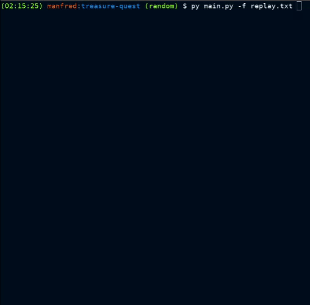

# :world_map: Treasure Quest :mountain:

Adventurers are searching for treasures :gem: in the new world :earth_africa: !  

## :tada: Examples

### :gem: Game of Life in action


## :electric_plug: Dependencies
1. :desktop_computer: Set your Virtual Environment :

	``` bash
	# Download venv librairy
	apt-get install python3-venv -y
	# Create your venv
	py -m venv my_venv
	# Activate your venv
	. venv/bin/activate
	```
	
	_For more information, go to [Python Virtual Environment Official Documentation](https://docs.python.org/3/library/venv.html)._


1. :package: Install the project dependencies

	``` bash
	pip install parameterized
 	pip install nose2
	```

## :zap: Quick start

1. :rocket: To start the project, simply run bellow commands:

	``` bash
	python treasure_quest.py
	```
 	
	- Result: 

		``` bash
		$ py treasure_quest.py 
		Input: 
			C - 3 - 4
			M - 1 - 0
			M - 2 - 1
			T - 0 - 3 - 2
			T - 1 - 3 - 3
			A - Lara - 1 - 1 - S - AADADAGGA
			
		Output:
			C - 3 - 4
			M - 1 - 0
			M - 2 - 1
			T - 1 - 3 - 2
			A - Lara - 0 - 3 - S - 3
		```

2. :robot: To run the tests, simply run bellow commands:

	``` bash
	python -m unittest discover
 	# or
 	nose2
	```
 
3. :file_folder: To use the file argument, run: 

	``` bash
	python treasure_quest.py -f <path to the file>
	```
 	
	- Result: It will store the result in `treasure_quest_results.txt`